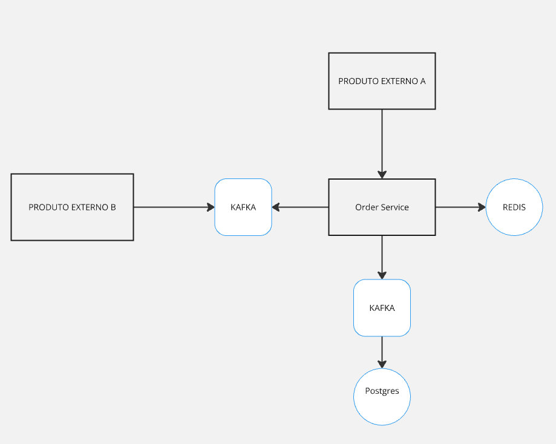

# Order Service - Gerenciamento de Pedidos
Este projeto é um serviço de gerenciamento de pedidos desenvolvido em Java com Spring Boot. 
Ele recebe pedidos de um sistema externo (Produto Externo A), processa os pedidos (calculando o valor total e gerenciando o status) 
e disponibiliza os pedidos processados para outro sistema externo (Produto Externo B). 
O sistema foi projetado para lidar com uma alta volumetria de pedidos (150 mil a 200 mil por dia) 
e utiliza tecnologias como Kafka, PostgreSQL, Docker e Swagger para garantir escalabilidade, resiliência e facilidade de uso.

## Tecnologias Utilizadas
Java 17: Linguagem de programação principal.

Spring Boot: Framework para desenvolvimento da aplicação.

Kafka: Sistema de mensageria para receber e enviar pedidos.

PostgreSQL: Banco de dados relacional para armazenar os pedidos.

Docker: Para containerização da aplicação e dependências.

Swagger: Documentação e teste da API.

Resilience4j: Para implementar Circuit Breaker e garantir resiliência.

## Como Rodar o Projeto
### Pré-requisitos
Docker e Docker Compose instalados.

Java 17 (opcional, apenas se quiser rodar localmente sem Docker).

### Passos para Execução

git clone https://github.com/seu-usuario/order-service.git
cd order-service

./gradlew clean build

docker-compose up

### Acessar a aplicação:

A aplicação estará disponível em: http://localhost:8080.

O Swagger UI estará disponível em: http://localhost:8080/swagger-ui/index.html#/

### Decisões de Projeto e Soluções para os Problemas
1. Verificação de Duplicação de Pedidos
   Problema: Como evitar que pedidos duplicados sejam processados?

Solução:

Utilizei o campo externalOrderId para identificar unicamente cada pedido.

Antes de processar um pedido, o sistema verifica no banco de dados se já existe um pedido com o mesmo externalOrderId.

Caso exista, o pedido é rejeitado ou atualizado, dependendo da lógica de negócio.

2. Alta Volumetria de Pedidos e Disponibilidade do Serviço
   Problema: Como garantir a disponibilidade do serviço com uma alta volumetria de pedidos?

Solução:

Utilizei o Kafka como sistema de mensageria para receber os pedidos do Produto Externo A. O Kafka é altamente escalável e consegue lidar com grandes volumes de mensagens.

A aplicação Spring Boot foi projetada para ser stateless, permitindo a escalabilidade horizontal (rodar múltiplas instâncias do serviço).

Utilizei Docker e Docker Compose para facilitar a orquestração e o deploy do sistema.

3. Consistência dos Dados e Concorrência
   Problema: Como garantir a consistência dos dados em um ambiente concorrente?

Solução:

Utilizei o PostgreSQL como banco de dados, com transações ACID para garantir a consistência dos dados.

Para evitar problemas de concorrência, utilizei bloqueios otimistas (@Version em entidades JPA) e transações de curta duração.

O Kafka também ajuda a garantir a ordem de processamento dos pedidos.

4. Volumetria e Engargalamento do Banco de Dados
   Problema: Como evitar que o banco de dados seja um gargalo com uma alta volumetria de pedidos?

Solução:

Utilizei o particionamento de tabelas no PostgreSQL (pg_partman) para dividir os dados em partições menores, melhorando o desempenho das consultas.

Configurei índices adequados nas colunas mais utilizadas (como externalOrderId).

Utilizei um pool de conexões (como o HikariCP) para gerenciar as conexões com o banco de dados de forma eficiente.

5. Armazenamento de Informações dos Pedidos
   Problema: Como armazenar os pedidos de forma eficiente e escalável?

Solução:

Utilizei o PostgreSQL para armazenar os pedidos e seus itens.

Os pedidos são armazenados em uma tabela (Order) e os itens dos pedidos em uma tabela relacionada (OrderItem).

Para garantir a escalabilidade, utilizei particionamento de tabelas e índices.

Arquitetura resumida
